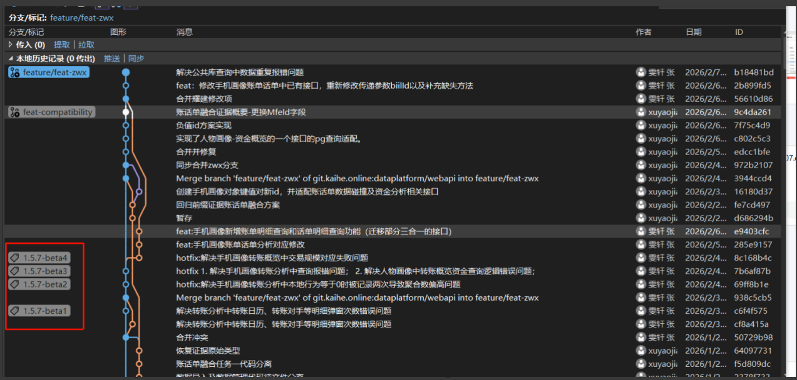
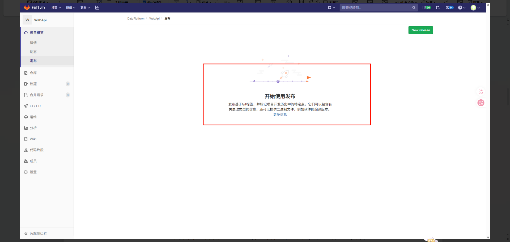
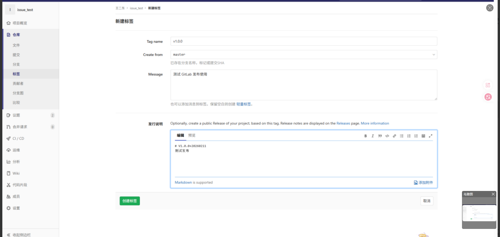
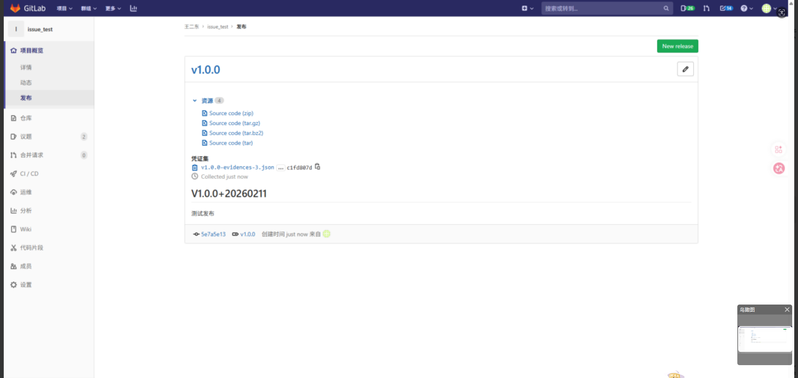

该规范非本项目规范，仅作为参考，不必强行满足。

# 总体原则

1. **IDE工具：统一使用 Visual Studio 2022 ，不区分社区版和企业版**；
2. **解决方案格式统一使用 `.sln` 格式，禁止创建 `.slnx` 格式项目文件。**
3. **使用 NuGet 包管理所有依赖**，禁止手动拷贝 DLL 文件到项目目录；所有包版本必须显式锁定，禁止使用浮动版本（如 `*`、`1.0.*`）。
4. **分层职责单一**，各层只做本层的事，禁止跨层直接调用，禁止在 Controller 中写业务逻辑，禁止在 Service 中写原生 SQL。
5. **依赖注入优先**，禁止在类内部手动 `new` 依赖对象，统一通过构造函数注入。
6. **异步优先**，所有 I/O 操作（数据库、网络、文件）必须使用 `async/await`，避免阻塞线程。
7. **禁止硬编码**，连接字符串、密钥、外部 URL 等必须放在 `appsettings.json` 或环境变量中，禁止出现魔法值（未经定义的常量直接使用）。
8. **所有公开属性、字段和方法需要提供注释**。
9. **关键代码需要使用 xUnit 编写单元测试**。关键代码是指频繁使用的热点方法，基础工具类等。
10. **采用标准的 GET/POST/PUT/DELETE 动作表示 查询，增加，修改和删除逻辑路由前准，而非统一使用 PSOT 和 GET**。【**本条为暂定，为了和 ZrAdmin 代码生部分代码保持一致性。**】

# 命名规范

##  通用命名原则

* 所有标识符一律使用**英文**，禁止使用拼音或拼音与英文混合，禁止使用中文。
* 名称必须有实际含义，禁止使用 `a`、`b`、`tmp`、`data` 等无意义名称。
* 杜绝不规范缩写，避免望文不知义。
* 所有变量必须赋初始默认值。
* 不得使用非常相近的名字来表示不同含义的变量、方法或类。

(**注意：因为 ZrAdmin 项目一开始就有自己的命名空间，新建的项目使用 KaingHe 开头，原本的 ZrAdmin 部分代码保持不变**)

| 元素                 | 规则                         | 示例                         |
| -------------------- | ---------------------------- | ---------------------------- |
| 命名空间             | `公司名.项目名.模块名`       | `KaingHe.ZrAdmin.Services`   |
| 类、接口、属性、方法 | PascalCase                   | `UserService`、`GetUserById` |
| 局部变量、方法参数   | camelCase                    | `userId`、`orderDto`         |
| 私有字段             | `_camelCase`（下划线前缀）   | `_userRepository`            |
| 常量                 | `UPPER_SNAKE_CASE`           | `MAX_RETRY_COUNT`            |
| 接口                 | `I` + PascalCase             | `IUserService`               |
| 抽象基类             | `Abstract` 或 `Base` 开头    | `BaseController`             |
| 异常类               | `Exception` 后缀             | `BusinessException`          |
| 枚举类型             | `Enum` 后缀，值用 PascalCase | `OrderStatusEnum`            |
| 异步方法             | `Async` 后缀                 | `GetUserAsync`               |
| 泛型类型参数         | `T` 前缀 + 描述性名称        | `TEntity`、`TResult`         |
| 测试类               | 被测类名 + `Test`            | `UserServiceTest`            |


## 项目层级命名

解决方案和项目按如下格式统一命名：

```
{公司/产品简称}{系统名}.sln
{公司/产品简称}{系统名}.WebApi
{公司/产品简称}{系统名}.Services
{公司/产品简称}{系统名}.Repository
{公司/产品简称}{系统名}.Models
{公司/产品简称}{系统名}.Common
```

示例：

```
KaingHe.UserCenter.sln
KaingHe.UserCenter.WebApi
KaingHe.UserCenter.Services
KaingHe.UserCenter.Repository
KaingHe.UserCenter.Models
KaingHe.UserCenter.Common
```

## 文件与类命名后缀

(注意：如果引入第三方项目完整源码，单独一个项目即可，保持原本项目命名即可，不用特意去修改。)

| 所在层               | 后缀规则                  | 示例                  |
| -------------------- | ------------------------- | --------------------- |
| WebApi 层 - 控制器   | `Controller` 结尾         | `UserController.cs`   |
| Services 层 - 接口   | `I` + 名称 + `Service`    | `IUserService.cs`     |
| Services 层 - 实现   | 名称 + `Service`          | `UserService.cs`      |
| Repository 层 - 接口 | `I` + 名称 + `Repository` | `IUserRepository.cs`  |
| Repository 层 - 实现 | 名称 + `Repository`       | `UserRepository.cs`   |
| Models 层 - 实体     | 名称 + `Model`            | `UserModel.cs`        |
| Models 层 - 请求 DTO | 名称 + `Dto`              | `UserCreateDto.cs`    |
| Models 层 - 视图模型 | 名称 + `ViewModel`        | `UserViewModel.cs`    |
| Common 层 - 工具类   | 名称 + `Helper`           | `JsonHelper.cs`       |
| Common 层 - 扩展方法 | 名称 + `Extensions`       | `StringExtensions.cs` |


## 控件命名（适用于含 UI 控件的项目）


* 【强制】所有控件必须使用代表其含义的名字，禁止使用默认控件名（如 `button1`、`textBox1`）。
* 【强制】命名规则：**控件缩写前缀 + 变量名**（PascalCase）。
* 【强制】控件属性名禁止使用汉字。

| 控件名         | 缩写    | 控件名        | 缩写  | 控件名     | 缩写  |
| -------------- | ------- | ------------- | ----- | ---------- | ----- |
| Label          | `lbl`   | TextBox       | `txt` | Button     | `btn` |
| ComboBox       | `cbo`   | DataGridView  | `dgv` | TreeView   | `tv`  |
| DateTimePicker | `dtp`   | NumericUpDown | `num` | GroupBox   | `gbx` |
| CheckBox       | `chk`   | Panel         | `pnl` | PictureBox | `pic` |
| TabControl     | `tbCtl` | TabPage       | `tp`  | Form       | `frm` |


## 方法命名约定

数据访问层方法统一使用以下前缀：**注意 ZrAdmin 代码生成功能默认使用 GET/POST/PUT/DELETE 实现查询，增加，修改和删除逻辑，而非统一使用 PSOT和GET**

| 操作         | 前缀                  | 示例           | route 示例                   |
| ------------ | --------------------- | -------------- | ---------------------------- |
| 获取单个对象 | `Get`                 | `GetUserAsync` | `GET /api/caseInfo/{id}`     |
| 获取多个对象 | `List` 或 `GetList`   | `ListAsync`    | `GET /api/caseInfo/list`     |
| 获取统计值   | `Count`               | `CountAsync`   | `GET /api/caseInfo/count`    |
| 插入         | `Insert` 或 `Add`     | `InsertAsync`  | `POST /api/caseInfo/add`     |
| 删除         | `Delete` 或 `Remove`  | `DeleteAsync`  | `DELETE /api/caseInfo/{id}`  |
| 修改         | `Update` 或  `Change` | `UpdateAsync`  | `PUT /api/lcaseInfo/update`  |
| 判断存在     | `Exists`              | `ExistsAsync`  | `GET  /api/lcaseInfo/exists` |
| 导入         | `Import`              | `ImportAsync`  | `POST /api/caseInfo/import`  |
| 导出         | `Export`              | `ExportAsync`  | `GET /api/caseInfo/export`   |


# 项目结构

## 标准解决方案结构

**注意一些独立的模块，如手机画像模块，数据仓储模块、账单模块、话单模块、情报模块、税票模块，单独创建项目**，把 Controller 、Models、Services 在一个项目中创建不同的文件夹管理，公共的需要被其他模块反复引用的，放到解决方案级别的 `XxxYyy.Models`、`XxxYyy.Services` 中

~~~
Solution/
│
├── XxxYyy.WebApi/                   # Web API 入口层
│   ├── Controllers/
│   │   ├── v1/
│   │   │   ├── UsersController.cs
│   │   │   └── OrdersController.cs
│   │   └── BaseController.cs
│   ├── Filters/
│   │   └── GlobalExceptionFilter.cs
│   ├── Middleware/
│   │   └── RequestLoggingMiddleware.cs
│   ├── appsettings.json
│   ├── appsettings.Development.json
│   ├── appsettings.Production.json
│   └── Program.cs
│
├── XxxYyy.Services/                 # 业务逻辑服务层
│   ├── Interfaces/
│   │   └── IUserService.cs
│   └── Implementations/
│       └── UserService.cs
│
├── XxxYyy.Repository/               # 数据访问存储层
│   ├── Interfaces/
│   │   └── IUserRepository.cs
│   └── Implementations/
│       └── UserRepository.cs
│
├── XxxYyy.Models/                   # 实体与 DTO 层
│   ├── Entities/
│   │   └── UserModel.cs
│   ├── Dto/
│   │   ├── UserCreateDto.cs
│   │   └── UserUpdateDto.cs
│   ├── ViewModels/
│   │   └── UserViewModel.cs
│   └── Enums/
│       └── UserStatusEnum.cs
│
├── XxxYyy.Common/                   # 公共方法和工具类
│   ├── Helpers/
│   │   ├── JsonHelper.cs
│   │   └── EncryptionHelper.cs
│   ├── Extensions/
│   │   └── StringExtensions.cs
│   ├── Constants/
│   │   └── CacheKeys.cs
│   └── Exceptions/
│       └── BusinessException.cs
│
└── XxxYyy.Tests/                    # 单元测试项目
    ├── Services/
    │   └── UserServiceTest.cs
    └── Repository/
        └── UserRepositoryTest.cs
~~~


**层间引用规则（单向依赖，严禁反向引用）**

~~~
WebApi  →  Services  →  Repository  →  Models
                                     ↗
              Common（可被任何层引用）
~~~


## 各层职责说明

### XxxYyy.WebApi — Web API 入口层

**职责：** 接收并分发 HTTP 请求、参数格式验证、调用 Services 层、封装并返回统一响应格式。

**禁止事项：**

- ❌ 禁止在 Controller 中编写任何业务逻辑
- ❌ 禁止在 Controller 中直接调用 Repository 层
- ❌ 禁止编写 SQL 语句或直接操作数据库
- ❌ 禁止直接返回数据库实体类，必须转换为 DTO 或 ViewModel

~~~c#
[ApiController]
[Route("api/[controller]")]
public class UsersController : ControllerBase
{
    private readonly IUserService _userService;

    public UsersController(IUserService userService)
    {
        _userService = userService;
    }

    /// <summary>根据 ID 获取用户</summary>
    /// <param name="id">用户 ID</param>
    /// <returns>用户视图模型，不存在时抛出业务异常</returns>
    [HttpGet("{id}")]
    public async Task<ApiResult<UserViewModel>> GetById(int id)
    {
        var result = await _userService.GetByIdAsync(id);
        return ApiResult.Success(result);
    }

    /// <summary>创建用户</summary>
    [HttpPost]
    public async Task<ApiResult> Create([FromBody] UserCreateDto dto)
    {
        await _userService.CreateAsync(dto);
        return ApiResult.Success();
    }
}
~~~

### XxxYyy.Services — 业务逻辑服务层


**职责：** 实现核心业务逻辑、跨 Repository 的事务管理、业务规则校验。

**禁止事项：**

- ❌ 禁止直接编写原生 SQL
- ❌ 禁止将数据库实体直接暴露给上层，必须映射为 DTO 或 ViewModel

~~~c#
public interface IUserService
{
    Task<UserViewModel> GetByIdAsync(int id);
    Task CreateAsync(UserCreateDto dto);
}

public class UserService : IUserService
{
    private readonly IUserRepository _userRepository;

    public UserService(IUserRepository userRepository)
    {
        _userRepository = userRepository;
    }

    public async Task<UserViewModel> GetByIdAsync(int id)
    {
        var entity = await _userRepository.GetByIdAsync(id);
        if (entity == null)
            throw new BusinessException("用户不存在");
        return entity.Adapt<UserViewModel>(); // Mapster 映射
    }

    public async Task CreateAsync(UserCreateDto dto)
    {
        bool exists = await _userRepository.ExistsAsync(x => x.Username == dto.Username);
        if (exists)
            throw new BusinessException("用户名已存在");
        var entity = dto.Adapt<UserModel>();
        await _userRepository.InsertAsync(entity);
    }
}
~~~

### XxxYyy.Repository — 数据访问存储层

**职责：** 封装所有数据库访问操作（PostgreSQL、ES、Neo4j 等），使用 SqlSugar ORM 进行 CRUD，不包含任何业务逻辑。

**禁止事项：**

- ❌ 禁止在 Repository 中包含业务判断逻辑
- ❌ 禁止硬编码数据库连接字符串
- ❌ 禁止直接使用原生 ADO.NET（特殊性能场景须经审批）

~~~c#
public interface IUserRepository
{
    Task<UserModel> GetByIdAsync(int id);
    Task<bool> ExistsAsync(Expression<Func<UserModel, bool>> predicate);
    Task<int> InsertAsync(UserModel entity);
}

public class UserRepository : IUserRepository
{
    private readonly ISqlSugarClient _db;

    public UserRepository(ISqlSugarClient db)
    {
        _db = db;
    }

    public async Task<UserModel> GetByIdAsync(int id)
    {
        return await _db.Queryable<UserModel>().FirstAsync(x => x.Id == id);
    }

    public async Task<bool> ExistsAsync(Expression<Func<UserModel, bool>> predicate)
    {
        return await _db.Queryable<UserModel>().AnyAsync(predicate);
    }

    public async Task<int> InsertAsync(UserModel entity)
    {
        return await _db.Insertable(entity).ExecuteReturnIdentityAsync();
    }
}
~~~

### XxxYyy.Models — 实体与 DTO 层


**职责：** 定义数据结构，不包含业务逻辑。

| 类型           | 说明                     | 示例                |
| -------------- | ------------------------ | ------------------- |
| Entity / Model | 数据库实体，与表字段对应 | `UserModel.cs`      |
| Dto            | 请求/响应数据传输对象    | `UserCreateDto.cs`  |
| ViewModel      | 返回前端的视图模型       | `UserViewModel.cs`  |
| Enum           | 枚举定义，带 `Enum` 后缀 | `UserStatusEnum.cs` |


### XxxYyy.Common — 公共方法和工具类


**职责：** 提供跨层复用的工具类、扩展方法、全局常量和自定义异常，不包含业务逻辑，不访问数据库。


| 文件                   | 说明                 |
| ---------------------- | -------------------- |
| `JsonHelper.cs`        | JSON 序列化/反序列化 |
| `EncryptionHelper.cs`  | 加密/解密            |
| `DateTimeHelper.cs`    | 时间处理             |
| `StringExtensions.cs`  | 字符串扩展方法       |
| `CacheKeys.cs`         | 缓存键常量           |
| `BusinessException.cs` | 业务异常基类         |
| `ApiResult.cs`         | 统一响应包装模型     |


# Git 规范

## 分支策略

~~~
main        # 预留，用于和 ZrAdmin 上游同步代码，禁止修改
business    # 保护分支，主分支，稳定发布版本
develop     # 日常集成开发
feature/*   # 功能分支
release/*   # 预发布，如 release/v1.2.0，每次打包或者合并 release 时，需要创建 tag
hotfix/*    # 线上紧急修复
~~~


> 注意：每次发布新版本或者给客户发升级包后，需要手动创建用版本号命名的 tag，并且把相应 tag 上传到远程服务器。注意 git push 不会主动上传 tag ，需要显示使用命令：
> ~~~shell
> # 基于当前提交创建 tag
> git tag -a  1.0.0 -m "Xx客户升级：修复无法导入工商银行格式问题"
> # 上传指定名称的 tag
> git push origin 1.0.0    # 上传指定 tag
> ~~~
>
> 

**提交规则：**

- 标题行尽量清晰明了，不要出现类似 “tmp”,“临时提交”这种无意义的说明。
- 禁止直接向 `main` / `master` 分支推送代码
- 必须通过 Pull Request / Merge Request 经代码审查后合并
- 每次提交保持原子性，只完成一个逻辑改动
- 提交前必须通过 `dotnet build` 和 `dotnet test`

###### Git Commint  参考和解释  

``` 
<type>(<scope>): <subject>
```

* type： 表示本次变动的分类
  * feat: 新功能
  * fix:  修复bug
  * docs:  添加或者修改文档
  * style：调整格式-不影响代码运行的变动
  * perf：优化相关，比如提升性能、体验
  * refactor：重构（即不是新增功能，也不是修改bug的代码变动）：命名空间调整、模块、依赖环境的升级
  * test:     增加测试
  * chore：构建过程或辅助工具的变动
  * revert: 回滚到上一个版本
  * merge：代码合并
  * sync: 同步主线或者分支的BUG
* scope：（可选）影响的范围，比如数据层、控制层、视图层等，根据项目不同替代。也可以直接写对应的模块：银行账单、通信话单、公安情报、账单一键分析等。如果涉及的层很多，可以用 （*） 表示。
* subject: 变动描述，描述具体的变动情况。

## 版本号规范


遵循语义化版本 **SemVer**：`Major.Minor.Patch[-Suffix][+build]` ，如 `1.0.0+20260318`,  `1.0.0-alpha+20260318`,

| 段     | 说明                                                         |
| ------ | ------------------------------------------------------------ |
| Major  | 重大变更，不向后兼容                                         |
| Minor  | 新增功能，向后兼容                                           |
| Patch  | Bug 修复，向后兼容                                           |
| Suffix | 预发布标识：`alpha` < `beta` < `rc`                          |
| build  | 构建元数据，不作为版本号优先级的判断，仅仅是标识，常见用日期备注，如 `+202603181110` |

优先级示例：`1.0.0-alpha` < `1.0.0-beta` < `1.0.0-rc.1` < `1.0.0`

发布时通过 **Git Tag + Releases** 管理，Tag 名称即软件版本号（如 `1.1.0`），Releases 附带更新说明和安装包。

为了简单点，可以通过**在做安装包时，给当前提交的 commit 打上 Tags ,开发测试结束打上 beta , 任务发起方测试或公司内部测试结束打上 rc，每次打 tag ，下面是在手机画像中的例子，通过简单打上 Tag 方便找到给客户的升级包时对应的”提交状态“，方便修改错误或者增加功能：**



为了方便管理，每周升级的时候，需要在公司的 Gitlab的 “Releases 发布” 页面，上传发布更新，内容，并且上传升级包，编写升级内容：









